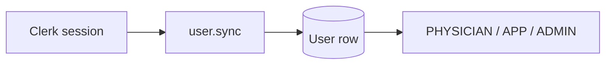

# ShiftHub

ShiftHub is a monorepo for **scheduling healthcare-style shifts**: admins publish schedule versions and shifts; physicians and APPs view the calendar, **request open slots** (admin approval), and **request swaps** with colleagues (counterparty acceptance, then admin approval). Authentication is **Clerk**; all roles, assignments, and workflow state live in **PostgreSQL** (e.g. Neon).

---

## Repository layout

| Path | Purpose |
|------|---------|
| `apps/web` | Next.js 15 app — schedule UI, admin, tRPC API route |
| `apps/mobile` | Expo app — schedule via tRPC (optional) |
| `packages/api` | tRPC `AppRouter` — business logic, Clerk-backed procedures |
| `packages/db` | Prisma schema, Prisma 7 client + PostgreSQL adapter |
| `packages/validators` | Shared Zod schemas |

Stack highlights: **tRPC** + **TanStack Query**, **superjson**, **Tailwind** + shadcn-style UI, **Turbo** for builds.

---

## Prerequisites

- **Node.js** ≥ 20  
- **pnpm** (see root `packageManager`)  
- **PostgreSQL** connection string (`DATABASE_URL`)  
- **Clerk** application (publishable + secret keys)

---

## Environment variables

Set variables in **repo root** and/or **`apps/web`** `.env.local` (Next merges both; see `apps/web/next.config.ts`). For **Turborepo on Vercel**, declare secrets used at build time in `turbo.json` under `globalEnv` (e.g. `DATABASE_URL`, `CLERK_SECRET_KEY`, `NEXT_PUBLIC_CLERK_PUBLISHABLE_KEY`) so tasks receive them.

| Variable | Where | Purpose |
|----------|--------|---------|
| `DATABASE_URL` | Root / API context | PostgreSQL connection string |
| `NEXT_PUBLIC_CLERK_PUBLISHABLE_KEY` | Web | Clerk browser / Frontend API |
| `CLERK_SECRET_KEY` | API / server | Clerk server SDK, `user.sync`, etc. |
| `ADMIN_EMAILS` | Server | Comma-separated emails that receive **ADMIN** on sync (bootstrap / dev) |
| `EXPO_PUBLIC_CLERK_PUBLISHABLE_KEY` | Mobile | Clerk for Expo |
| `EXPO_PUBLIC_API_URL` | Mobile | Base URL of the web API (tRPC) |

Optional: Sentry, Datadog (`NEXT_PUBLIC_*`), `AI_MODEL` for AI-related admin tools.

---

## Local setup

```bash
pnpm install
```

1. Create `.env.local` at the repo root (and optionally `apps/web/.env.local`) with `DATABASE_URL`, `NEXT_PUBLIC_CLERK_PUBLISHABLE_KEY`, `CLERK_SECRET_KEY`, and optionally `ADMIN_EMAILS`.

2. Generate the Prisma client and apply the schema:

   ```bash
   pnpm db:generate
   pnpm db:push
   ```

   Or use migrations: `pnpm db:migrate`.

3. Run the web app:

   ```bash
   pnpm dev
   ```

   Turbo runs workspace dev tasks; the Next app is typically at `http://localhost:3000`.

4. **First admin:** either set `ADMIN_EMAILS=you@example.com` and sign in, then open **Schedule** once so `user.sync` runs, **or** set `User.role = ADMIN` in Prisma Studio (`pnpm db:studio`).

---

## Functional workflow (end-to-end)

### 1. Authentication and identity

1. User signs in/up via **Clerk** (web: `/sign-in`, `/sign-up`).
2. On first visit to **Schedule**, the client calls **`user.sync`**, which upserts a **User** row keyed by `clerkId` with email, name, phone (from Clerk or hints).
3. **Roles** (`PHYSICIAN`, `APP`, `ADMIN`) are stored **only in Postgres**, not in Clerk.
4. **Default role** for new users is **PHYSICIAN**. If the user’s email appears in **`ADMIN_EMAILS`**, sync assigns **ADMIN**. Existing users keep their DB role unless the allowlist upgrades them to **ADMIN**.



---

### 2. Admin — schedule versions and shifts

1. **Admin** opens **`/admin`** (requires `User.role === ADMIN`).
2. **Schedule version:** create a **draft** version (label + year). Versions are listed; the **latest by year** is what the schedule page uses first when listing versions (see code: `schedule.listVersions`).
3. **Publish:** publishing a version sets it (and its shifts) to **published** workflow where applicable.
4. **Shifts:** add shifts tied to a **schedule version**, a **site**, coverage category, optional inpatient split, **start/end** `DateTime`, optional assignee, and status **DRAFT** / **PUBLISHED**.
5. **Scoped scheduling:** the admin form can create a single shift spanning **day / week / month / year** (one row whose `startsAt`/`endsAt` cover that period).

Open **published** shifts with **no assignee** are the slots physicians can **request to pick up** (after publish).

---

### 3. Physician / APP — schedule view

1. User opens **`/schedule`**.
2. The app loads **schedule versions** and picks an active version id, then loads **shifts** for the selected **week** (`shift.list` with date range + optional version id).
3. **Week timeline** shows shifts with:
   - **Site** color and name  
   - **Time** in local format; multi-day shifts appear on **each day** they overlap  
   - **Open** vs **assigned**, **draft** vs **published**  
   - **Pending pickup** indicators when a pickup request is awaiting admin review  
4. **Site visibility:** users can hide sites in the product (if exposed in UI); hidden sites are filtered in `shift.list`.

---

### 4. Slot pickup (request → admin approve / reject)

1. Physician taps an **open**, **published** slot and chooses **Request pickup**.
2. API creates a **`PickupRequest`** (`PENDING`), optionally **locks** the slot for competing pickups, and writes **audit** logs including **`ADMIN_REVIEW_QUEUED`** (for operational tracking; email can be wired separately).
3. **Admin** opens **`/admin`** → **Pending slot pickups**:
   - **Approve** → assignee on the shift is set to the requester; other pending pickups for that shift are denied.
   - **Reject** → admin must enter a **rejection note** (stored on **`PickupRequest.resolutionNote`**); lock is cleared.
4. The physician can see **recent denied pickups** and notes on the schedule page via **`myPickupRequests`**.

Only **PUBLISHED** shifts accept pickup requests.

---

### 5. Shift swap (physician ↔ physician → admin)

1. Physician selects **their own** assigned shift and chooses **another physician’s** shift in the same week (**Request swap**).
2. API creates a **`SwapRequest`** with status **`PENDING_COUNTERPARTY`** (requester is user A; counterparty is user B).
3. **Counterparty (B)** sees the request under **Swap requests** on **`/schedule`** and taps **Accept swap** → status becomes **`PENDING_ADMIN`**; audit logs include **`ADMIN_REVIEW_QUEUED`**.
4. **Admin** → **Pending shift swaps**:
   - **Approve swap** → assignees on the two shifts are exchanged.
   - **Reject swap** → admin must enter a **note** (stored on **`SwapRequest.resolutionNote`**).
5. Users see **denied** swaps (with admin text) in **Swap requests** when status is **DENIED**.

---

### 6. Audit and org settings

- **AuditLog** records actions (pickup, swap, publish, etc.) with `actorId` and optional `shiftId`.
- **OrgSettings** (`id: "default"`) can store **`adminNotificationEmail`** for future email integration; the UI reminds admins that real notifications require wiring a mail provider.

---

### 7. API surface (tRPC)

High-level routes (see `packages/api/src/root.ts`):

| Area | Examples |
|------|----------|
| `user` | `sync`, `me` |
| `schedule` | `listVersions`, `createVersion`, `publishVersion` |
| `shift` | `list`, `create`, `update` |
| `site` | `list`, `setVisibility` |
| `workflow` | `requestPickup`, `approvePickup`, `denyPickup`, `listPendingPickups`, `pickupRequestsForShifts`, `myPickupRequests`, `requestSwap`, `acceptSwapCounterparty`, `approveSwapAdmin`, `denySwapAdmin`, `listPendingSwaps`, `listMySwapRequests` |
| `org`, `directory`, `audit`, `integration`, `ai` | As implemented |

Web client: HTTP batch link to **`/api/trpc`** with **superjson**.

---

## Build and deploy

```bash
pnpm build
pnpm typecheck
```

- **Vercel:** set root or `apps/web` as appropriate; ensure **`DATABASE_URL`**, **`CLERK_SECRET_KEY`**, **`NEXT_PUBLIC_CLERK_PUBLISHABLE_KEY`** (and any other server vars) are in the Vercel project **and** in **`turbo.json` `globalEnv`** if you use Turbo remote cache / strict env passthrough.
- Apply DB migrations (or `db push`) against production Postgres before relying on new columns (e.g. **`resolutionNote`** on pickup/swap requests).

---

## Mobile app

`apps/mobile` uses Clerk + tRPC against **`EXPO_PUBLIC_API_URL`**. Flow mirrors the web schedule at a high level; ensure the API URL points at your deployed Next origin.

---

## Scripts (root)

| Script | Purpose |
|--------|---------|
| `pnpm dev` | Turbo dev |
| `pnpm build` | Turbo build |
| `pnpm db:generate` | Prisma generate |
| `pnpm db:push` / `db:migrate` | Schema to database |
| `pnpm db:studio` | Prisma Studio |

---

## License

Private / unlicensed unless otherwise specified by the project owner.
